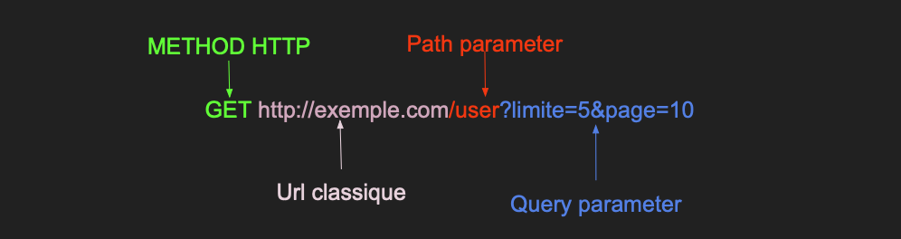
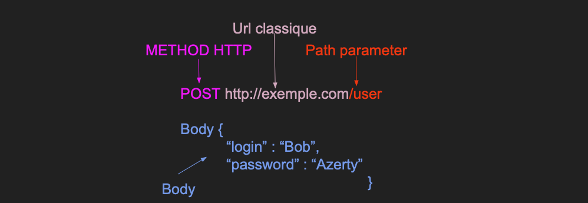

# Introduction à FAST API


# Prérequis
- Python
- Docker
- Bash
one
Le projet aura l'architecture suivante : 

```bash
project/
│
├── api.py             # API FastAPI.
├── Dockerfile         # Dockerfile pour la création de l'image FastAPI.
└── requirements.txt   # Dépendances Python.
```

# Définition d'une API

Une API (Interface de Programmation d'Application) est un ensemble **standardisé** de classes, de méthodes, de fonctions et de constantes qui sert de **façade** à travers laquelle un **logiciel offre des services à d'autres logiciels**. Une API est très souvent accompagnée d'une documentation qui spécifie comment des programmes **"consommateurs"** peuvent utiliser les fonctionnalités du programme **"fournisseur"**.

Une API permet donc à un produit ou service de communiquer avec d'autres produits et services sans connaître les détails de leur mise en œuvre. Le but des API est d'être utilisées par de nombreux développeurs. Dans ce contexte, une documentation accessible et facilement exploitable est une condition préalable au développement des API. Il est important d’avoir une documentation toujours à jour lorsque le code ou les fonctionnalités de l’API évoluent.

### Exemple 1

Contexte : Un utilisateur souhaite accéder à ses informations client depuis son navigateur.

0 - L'utilisateur lit la documentation de l'API et apprend que la ressource est disponible à l'URL suivante :

- GET http://www.exemple.com/user/\<nom_utilisateur> (remplacer <nom_utilisateur> par la valeur correspondante).

1 - L'API reçoit la requête et reconnaît le chemin.

2 - L'API fait une requête à la base de données.

3 - La base de données retourne les informations de l'utilisateur.

4 - L'API retourne les informations à l'utilisateur avec le code de statut "200" pour indiquer la réussite de l'opération.


### Exemple 2

Contexte : Un utilisateur souhaite accéder à ses informations client depuis l'interface d'un site web.

0 - L'utilisateur clique sur le bouton "informations utilisateur".

1 - En réponse, l'application front-end envoie une requête à l'API en utilisant la bonne route.

2 - L'API reçoit la requête et fait une requête à la base de données.

3 - La base de données retourne les informations de l'utilisateur.

4 - L'API retourne les informations et le front-end se charge d'afficher ces informations à l'utilisateur.


### Exemple 3 

Contexte : Une application souhaite faire des requêtes à une base de données pour effectuer diverses tâches.

0 - Le développeur lit la documentation de l'API et apprend que la ressource est disponible à l'URL suivante :

GET http://www.exemple.com/item/\<nom_item> (remplacer <nom_item> par la valeur correspondante).
Le développeur implémente donc une fonction qui effectue la requête nécessaire.

1 - L'API reçoit la requête.

2 - L'API fait une requête à la base de données.

3 - La base de données retourne l'item.

4 - L'API retourne les données à l'application (code de statut 200).


# Comprendre les routes

Pour utiliser une API, un développeur a besoin d'une documentation. Le rôle de cette documentation est d'indiquer les différents chemins que l'utilisateur peut utiliser.

## Les méthodes

HTTP définit un ensemble de méthodes de requête qui indiquent l'action que l'on souhaite réaliser sur la ressource indiquée. Lors de la création d'API, vous utilisez normalement ces méthodes HTTP spécifiques pour effectuer une action particulière.

#### GET (Lire des données)
La méthode GET demande une représentation de la ressource spécifiée. Les requêtes GET doivent uniquement être utilisées afin de récupérer des données.

#### POST (Créer des données)
La méthode POST est utilisée pour envoyer une entité vers la ressource indiquée. Cela entraîne généralement un changement d'état ou des effets de bord sur le serveur.

#### PUT (Mise à jour des données)
La méthode PUT remplace toutes les représentations actuelles de la ressource visée par le contenu de la requête.

#### DELETE (Supprimer des données)
La méthode DELETE supprime la ressource indiquée.

## Exemple pour une requête GET

Une requête est composée de plusieurs parties (le nombre varie selon le type de méthode HTTP) :

- La partie méthode permet de choisir le type de requête HTTP à utiliser.
- La partie URL indique le chemin d'origine des ressources.
- La partie path parameter est un paramètre dans l'URL qui permet au client de sélectionner une ressource spécifique.
- La partie query (query parameter) est l'ensemble des paires clé-valeur qui suivent le "?" dans une URL, séparées par des caractères "&". Elle permet généralement le filtrage des données (exemple : mise en place d'un système de pagination pour afficher un certain nombre de ressources par page).



## Exemple pour une requête POST

Une requête est composée de plusieurs parties (le nombre varie selon le type de méthode HTTP) :

- La partie méthode permet de choisir le type de requête HTTP à utiliser.
- La partie URL indique le chemin d'origine des ressources.
- La partie **Path parameter** est un parmètre dans l'url qui permet au client la séléction d'une ressource spécifique.
- La partie **body** (request body parameter) est un json avec des données à envoyer à l'API. (Exemple : identifiant de connexion)



# Les Avantages

### Abstraction 

Une API fournit une couche d'abstraction entre l'application et la base de données. Cela signifie que les développeurs peuvent interagir avec l'API sans avoir besoin de connaître la structure interne de la base de données, ce qui simplifie le développement.

### Sécurité 

Les API peuvent contrôler l'accès aux données et restreindre les opérations autorisées. Cela réduit le risque d'exposition de la base de données aux attaques. En utilisant une API, les développeurs peuvent implémenter des mécanismes d'authentification et d'autorisation pour protéger les données sensibles.

### Modularité 

Les API permettent de séparer les différentes parties d'une application, ce qui favorise la modularité et facilite la maintenance. Une modification de la base de données ou des logiques d'accès peut être effectuée sans affecter les applications qui consomment l'API.

### Interopérabilité

Les API utilisent des protocoles standard comme HTTP, ce qui permet à différentes applications, éventuellement écrites dans des langages différents, de communiquer facilement entre elles. Cela facilite l'intégration avec d'autres services et applications.

### Versioning

Les API peuvent être versionnées, permettant aux développeurs de déployer des mises à jour sans interrompre les services existants. Cela permet de maintenir la compatibilité avec les clients utilisant des versions plus anciennes de l'API.

### Journalisation et Monitoring

Les API peuvent inclure des fonctionnalités de journalisation et de surveillance, ce qui permet de suivre les requêtes et d'analyser les performances. Cela aide à détecter des problèmes et à améliorer l'expérience utilisateur.

### Scalabilité 

En utilisant une API, il est plus facile de mettre en œuvre des solutions de mise à l'échelle, comme le caching ou la répartition de la charge, pour améliorer les performances des applications.

### Facilité de test

Les API peuvent être testées indépendamment de l'application cliente, ce qui facilite la détection de bugs et l'amélioration de la qualité.

# A retenir 

Pour accéder à une ressource, il est nécessaire d'indiquer son chemin ainsi que la méthode HTTP à utiliser.

Les méthodes HTTP sont les suivantes : POST, GET, HEAD, PUT, DELETE.

Les différents paramètres composant une requête HTTP sont les suivants : path parameter, query parameter, request body parameter.

Les différents chemins sont décrits par la documentation de l'API. C'est donc le créateur de l'API qui décide de ce qu'il souhaite exposer à ses clients via un protocole bien défini. Si un client souhaite obtenir une ressource non implémentée par le développeur de l'API, celui-ci n'y aura pas accès.

# FAST API

FastAPI est un framework web moderne, rapide (haute performance) pour la construction d'API avec Python, basé sur les annotations de types standard de Python.

# Création d'un environnement de travail 

Pour ce TP, nous allons travailler en local. Toutes les requêtes devront s'effectuer à partir du chemin suivant :
- http://localhost:8000

Pour éviter d'installer Python et les différentes bibliothèques, nous allons utiliser Docker.

## Lancer un serveur uvicorn

Depuis un terminal, allez à l'emplacement du Dockerfile et exécutez la commande suivante :

```bash
docker build -t fastapi:0.0.1 .
```

Pour exécuter le programme (main.py) :

```bash
docker run -p 8000:8000 fastapi:0.0.1
```

Le terminal affiche :

```bash
INFO:     Started server process [1]
INFO:     Waiting for application startup.
INFO:     Application startup complete.
INFO:     Uvicorn running on http://0.0.0.0:8000 (Press CTRL+C to quit)
```

Allez maintenant sur http://127.0.0.1:8000/docs ou http://localhost:8000/docs

Vous verrez la documentation interactive automatique de l'API (fournie par Swagger UI).

Pour quitter le serveur, utilisez la commande **ctrl + c** 


# I - Création d'une route GET avec un PATH PARAMETER

Objectif : Création d'une route qui retourne un nom d'utilisateur passé en paramètre (Path parameter).

I - Définir un path operator decorator

II - Définir une path operation function

III - Retourner l'utilisateur en paramètre de la requête HTTP (Path parameter)

Code final : 

``` python
@app.get("/user/{user_name}")
async def read_user(user_name : str) :
    return {"user_name" : user_name}
```
Allez maintenant sur http://127.0.0.1:8000/docs ou http://localhost:8000/docs.

Amusez-vous avec la route GET /user/{user_name}.

Avec la requête suivante : GET http://localhost:8000/user/michaelScott.

Vous aurez la réponse suivante :

Response header :
``` bash
content-length: 23 
content-type: application/json 
date: Tue,10 Sep 2024 08:15:38 GMT 
server: uvicorn 
``` 
Response body : 
``` bash
{ "user_name": "michaelScott" }
``` 

Status code : 200


# II - Création d'une route GET avec filtrage QUERY PARAMETER

I - Création d'une liste qui servira de "base de données".

II - Définir un path operator decorator.

III - Retourner une liste d'utilisateurs et filtrer la liste à l'aide des paramètres skip et limit.

``` python
users = [
    { "user_name": "michaelScott", "password": "That's what she said" }, 
    { "user_name": "JimHalpert", "password": "Dwight tried to kiss me" }, 
    { "user_name": "dwightShrute", "password": "I am faster than 80% of all snakes" }
]

@app.get("/user/")
async def read_user(skip: int = 0, limit: int = 3): 
    return users[skip: skip + limit]

```

Allez maintenant sur http://127.0.0.1:8000/docs ou http://localhost:8000/docs.

Amusez-vous avec la route GET /user/?skip=<int>&limit=<int>.

Avec la requête suivante : GET http://localhost:8000/user/?skip=1&limit=2.

Vous aurez la réponse suivante :

Request URL : http://localhost:8000/user/?skip=1&limit=2.

Response Body :
``` bash
 [
  {
    "user_name": "JimHalper",
    "password": "Dwight tried to kiss me"
  },
  {
    "user_name": "dwightShrute",
    "password": "I am faster than 80% of all snakes"
  }
]
```

``` bash
Response header :
    content-length: 141 
    content-type: application/json 
    date: Wed,11 Sep 2024 14:36:57 GMT 
    server: uvicorn 
```

Status code : 200


# III - Création d'une route POST avec QUERY à envoyer

I - Création d'un modèle qui servira de schéma de validation pour les données.

II - Définir un path operator decorator.

III - Retourner l'utilisateur (données envoyées).

``` python
class User(BaseModel) :
    first_name : str
    last_name : str
    disable : bool

@app.post("/users/")
async def add_user(user : User) : 
    return user 
```

Allez maintenant sur http://127.0.0.1:8000/docs ou http://localhost:8000/docs.

Amusez-vous avec la route POST http://localhost:8000/users/.

Avec la requête et le body suivant : POST http://localhost:8000/users/.

Request Body :

``` bash
{
    "first_name": "Bob",
    "last_name": "Kenny",
    "disable": true
}
```

Vous aurez la réponse suivante :  

Request URL : http://localhost:8000/users/

Response Body :
``` bash
{
    "first_name": "Bob",
    "last_name": "Kenny",
    "disable": true
}
```
Response header : 
``` bash
    content-length: 55 
    content-type: application/json 
    date: Thu,12 Sep 2024 05:52:11 GMT 
    server: uvicorn 
```

Status code : 200

# IV - Conclusion

Dans ce cours sur FastAPI, vous avez appris à créer et gérer des API en utilisant ce framework moderne et performant. Voici les points essentiels abordés :

API et Routes : 
- Une API permet à différentes applications de communiquer entre elles. Les routes définies dans FastAPI vous permettent de spécifier les chemins et les méthodes HTTP (comme GET, POST, PUT, DELETE) nécessaires pour interagir avec des ressources. Vous avez également vu comment passer des paramètres dans l'URL ou filtrer les requêtes avec des paramètres de requête.

Gestion des requêtes : 
- FastAPI utilise Pydantic pour valider automatiquement les données entrantes, facilitant ainsi la gestion des requêtes. Vous pouvez recevoir des données via POST et les lire via GET, tout en validant leur format grâce à des modèles de données.

Avantages : 
- FastAPI vous offre plusieurs avantages, comme l'abstraction des bases de données, une sécurité renforcée, et une grande modularité. Elle favorise aussi la communication entre différentes applications, tout en assurant la scalabilité et la facilité de test.

Mise en place : 
- Vous avez appris à configurer un environnement de développement avec Docker et à exécuter un serveur Uvicorn pour tester et utiliser localement vos API.


En conclusion, FastAPI est un framework rapide et simple à utiliser, idéal pour créer des API performantes, avec l'avantage d'une documentation interactive prête à l'emploi.